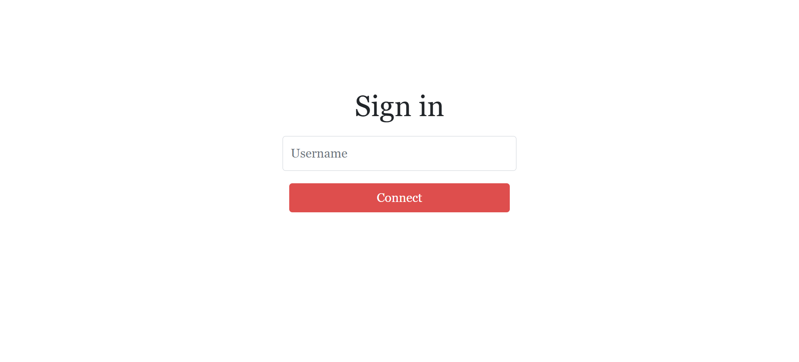
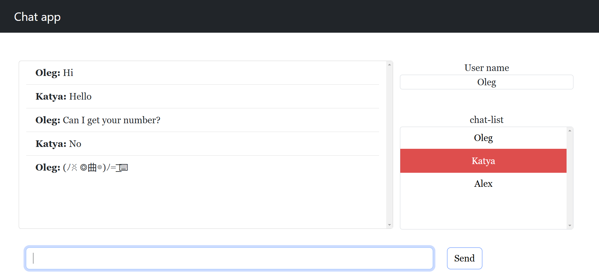
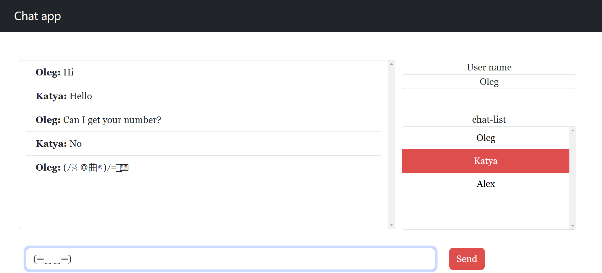
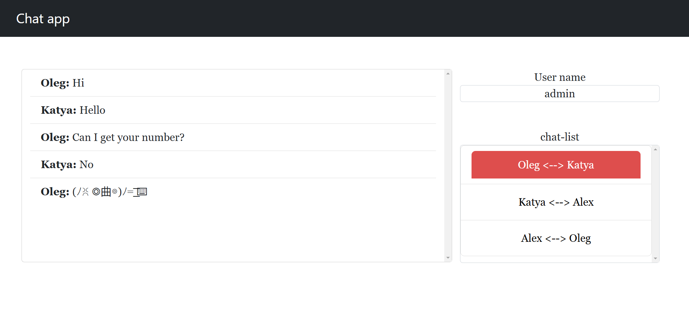

# Chat application

This is a straightforward chat application built using Angular on the frontend, Spring Boot on the backend, and WebSockets for real-time communication.

Sing in page:

User1 View:

User2 View:

Admin View:

